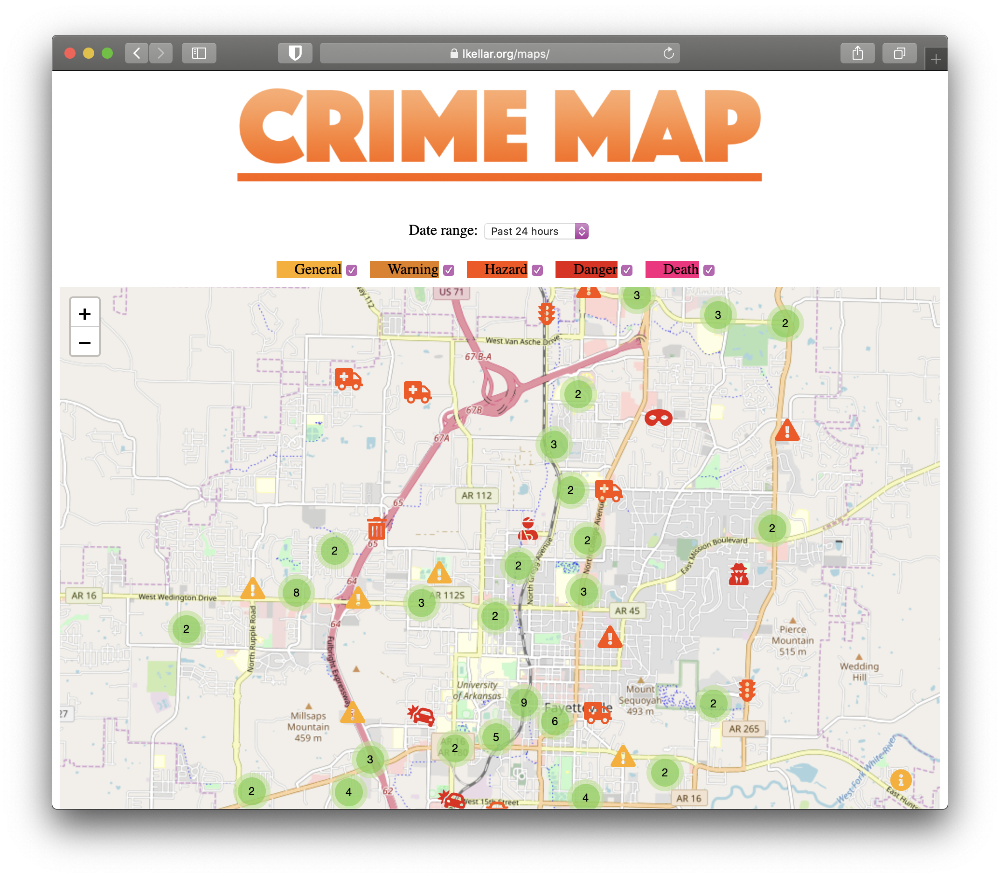

# Crime Map
An easy way to see recent 911 calls made in Fayetteville, Arkansas

## History
We made this project for the [2019 JB Hunt Hackathon](https://hackathon.jbhunt.com/home) and actually won first prize!

## Installation
Installation is pretty simple. Clone the repo, install python dependencies with pipenv

`pipenv install`

Next, run the scraper with the following sample command:

`python -m maps.scrape 30`

which will scrape 911 calls for the past 30 days. Read the [Scraper documentation](#scraper) for more info.

Once you've scraped the data, go ahead and start the flask server!, which resides in the maps.py file.

#### ALSO, THERE IS MORE; ENVIRONMENT VARIABLES
- `BING_MAPS_KEY`: A api key for the [Bing Maps Geocode Dataflow API](https://docs.microsoft.com/en-us/bingmaps/spatial-data-services/geocode-dataflow-api/). Its required for cities like Springdale which don't provide coordinates.

- `MAPS_SENTRY_DSN`: A DSN for sentry. If provided, sentry error reporting is setup.

## Website

Once the server is up and running, this is what users see. We hope it's pretty clear on how to use!

## Scraper

The Scraper fetches 911 calls and inserts them into the call database. You can run the scraper like this:

`python -m maps.scrape`

The above command would scrape all data back to 24 hours ago. You can also specify how far back you want to scrape:

`python -m maps.scrape 15`

The above command would scrape 15 days. 
